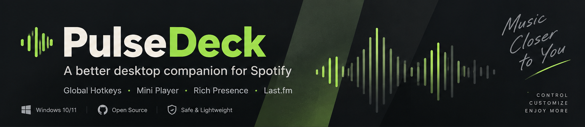
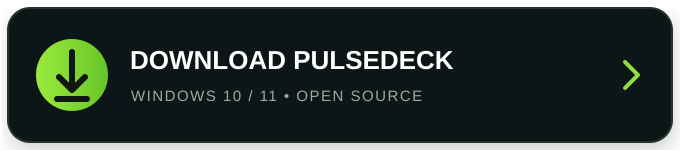
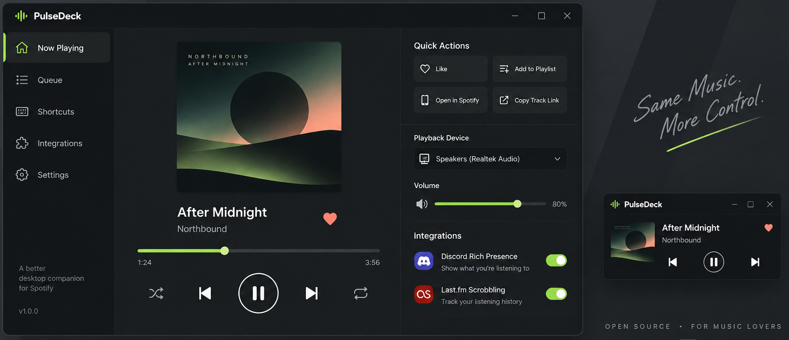

 

# PulseDeck

### A BETTER DESKTOP COMPANION FOR SPOTIFY

**Control your music faster. Keep your workflow uninterrupted.**

 

`Windows 10/11` · `Global Hotkeys` · `Mini Player` · `Last.fm` · `Discord Rich Presence`

 

---

## Music controls that stay out of your way

**PulseDeck** is an open-source desktop companion designed to complement Spotify on Windows.

Control playback from global shortcuts, keep a compact mini player on screen, expose useful track actions, and connect optional integrations — without replacing the official Spotify client.

 

  
<strong>SAME MUSIC. MORE CONTROL.</strong>

---

## Features

| | Feature | Description |
|---|---|---|
| ⌨ | **Global Hotkeys** | Control playback without switching windows. |
| ▣ | **Mini Player** | Keep track information and essential controls within reach. |
| ♫ | **Now Playing** | View the current track, artist and playback progress. |
| ♥ | **Quick Actions** | Access common music actions from one compact interface. |
| ◉ | **Discord Rich Presence** | Optionally show what you're listening to on Discord. |
| ↗ | **Last.fm** | Connect Last.fm for compatible listening-history workflows. |

---

## Download

**Windows 10 / 11**

> Replace `#` with your project's official release or download URL.

### Installation

**1. Download** — Get the latest PulseDeck release.

**2. Install** — Launch the Windows installer and follow the setup wizard.

**3. Connect** — Configure the supported Spotify integration and any optional services you want to use.

**4. Enjoy** — Use shortcuts, the mini player and desktop controls while Spotify handles playback.

---

## Designed as a companion

PulseDeck is **not a modified Spotify client** and does not unlock subscription features.

It is designed to work alongside Spotify and supported APIs/integrations. Availability of Spotify functionality can depend on Spotify's current platform capabilities, account type, API policies and regional availability.

---

## Disclaimer

PulseDeck is an independent project and is **not affiliated with, endorsed by, or sponsored by Spotify AB**. Spotify and its associated marks are trademarks of their respective owners.

---

### PulseDeck

**MUSIC CLOSER TO YOU.**

Open source · Built for music lovers

